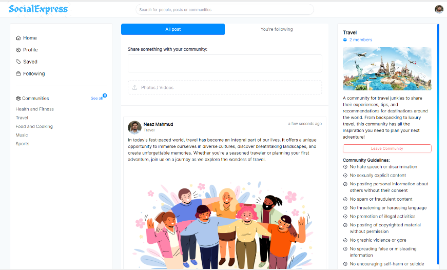

# 🚀 VibeShare – Social Networking Platform

A modern MERN-stack social platform with **AI-powered content moderation**, community posting, follows, likes, comments, and role-based admin & moderator dashboards.

🖼️ **UI Preview:**  


---

## 📚 Table of Contents
- [Project Overview](#project-overview)
- [Features](#features)
- [Technologies](#technologies)
- [Schema Diagram](#schema-diagram)
- [Getting Started](#getting-started)
- [Configuration](#configuration)
- [Usage Guide](#usage-guide)
- [Demo Accounts](#demo-accounts)

---

## 📌 Project Overview

**VibeShare** is a social media platform designed with the **MERN (MongoDB, Express, React, Node.js)** stack.  
It includes:

### 🔍 Automated Content Moderation
Every post undergoes AI-based analysis through:

- **Perspective API** – toxicity, hate, harassment, profanity  
- **TextRazor API** – content categorization  
- **HuggingFace BART-MNLI** – zero-shot classification  
- **Optional local Flask classifier**

A unified service layer allows enabling/disabling/modifying moderation providers without breaking the system.

### 👥 User Roles
- **Admin** – manages moderators, communities, and platform controls  
- **Moderator** – reviews reported posts and moderates communities  
- **General User** – can post, like, comment, follow, and save posts  

---

## ⭐ Features

- [x] User authentication (JWT)  
- [x] User profile management  
- [x] Create posts (with media)  
- [x] Comments system  
- [x] Like posts  
- [x] Save posts  
- [x] Follow / Unfollow  
- [x] Community-based posting  
- [x] Report posts  
- [x] AI-driven content moderation  
- [x] Admin dashboard  
- [x] Moderator dashboard  
- [x] Email notifications  

---

## 🛠 Technologies

### Frontend
- React.js  
- Redux Toolkit  
- Tailwind CSS  

### Backend
- Node.js  
- Express.js  
- MongoDB  
- Passport.js (JWT)  
- Crypto-JS  
- Nodemailer  
- Optional Flask AI classifier  

### External Services
- Perspective API  
- TextRazor API  
- HuggingFace Transformers  
- Azure Blob Storage / Cloudinary  

---

## 🗺 Schema Diagram


---

## 🚀 Getting Started

### ✔ Prerequisites
- Node.js  
- MongoDB or MongoDB Atlas  

---

### 📥 Installation

1. **Clone the repository**
```bash
git clone https://github.com/Yashash1234/VibeShare.git
Install frontend dependencies

bash
Copy code
cd client
npm install
Install backend dependencies

bash
Copy code
cd server
npm install
Create .env files
Use .env.example in both folders as reference.

Start backend

bash
Copy code
cd server
npm start
Start frontend

bash
Copy code
cd client
npm start
⚙️ Configuration
Email (for notifications)
makefile
Copy code
EMAIL=
PASSWORD=
EMAIL_SERVICE=
Moderation APIs (optional)
makefile
Copy code
PERSPECTIVE_API_KEY=
TEXTRAZOR_API_KEY=
INTERFACE_API_KEY=
Optional Local Classifier
See the classifier_server/ folder.

Note: Moderation services are optional — the platform still works if unset.

📌 Usage Guide
👑 Admin Dashboard (/admin)
Manage moderators

Manage communities

Review reports

Configure moderation services

🛡 Moderator
Emails ending with: @mod.vibeshare.com

Reviews reported posts

Manages assigned communities

👤 User
Create posts

Follow/unfollow

Like/comment

Save posts

Report harmful content

🧪 Demo Accounts
👑 Admin Login
pgsql
Copy code
Username: admin
Password: Admin@123
👤 Demo User
graphql
Copy code
Email: demo@vibeshare.com
Password: Demo@123
👥 Sample Users
Email	Password
arjun@vibeshare.com	User@123
meera@vibeshare.com	User@123
rohan@vibeshare.com	User@123
aditi@vibeshare.com	User@123
rahul@vibeshare.com	User@123

yaml
Copy code

---

# 🎉 All done  
If you want:

✅ A smaller README  
✅ A more market-friendly short version  
✅ A version with GIF previews  
✅ A version tailored for job applications

Just say:

👉 **“Give me a recruiter-optimized README”**


